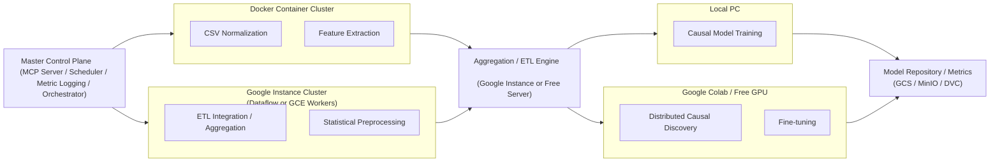

## 🧩 Causal Discovery Pipeline Architecture (Mermaid UML - Balanced Layout)

```mermaid
flowchart LR

%% =========================
%% Control Plane
%% =========================
A["Master Control Plane        \n(MCP Server / Scheduler / Metric Logging / Orchestrator)"]

%% =========================
%% Data Processing Layer
%% =========================
subgraph B1["Docker Container Cluster              "]
    B1a["CSV Normalization            "]
    B1b["Feature Extraction           "]
end

subgraph B2["Google Instance Cluster            \n(Dataflow or GCE Workers)"]
    B2a["ETL Integration / Aggregation          "]
    B2b["Statistical Preprocessing              "]
end

%% =========================
%% Aggregation Layer
%% =========================
C["Aggregation / ETL Engine                \n(Google Instance or Free Server)"]

%% =========================
%% Learning Layer
%% =========================
subgraph D1["Local PC                  "]
    D1a["Causal Model Training          "]
end

subgraph D2["Google Colab / Free GPU                "]
    D2a["Distributed Causal Discovery         "]
    D2b["Fine-tuning                         "]
end

%% =========================
%% Repository Layer
%% =========================
E["Model Repository / Metrics            \n(GCS / MinIO / DVC)"]

%% =========================
%% Connections
%% =========================
A --> B1
A --> B2
B1 --> C
B2 --> C
C --> D1
C --> D2
D1 --> E
D2 --> E
```